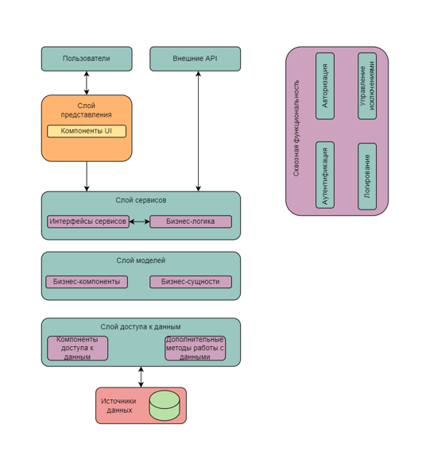
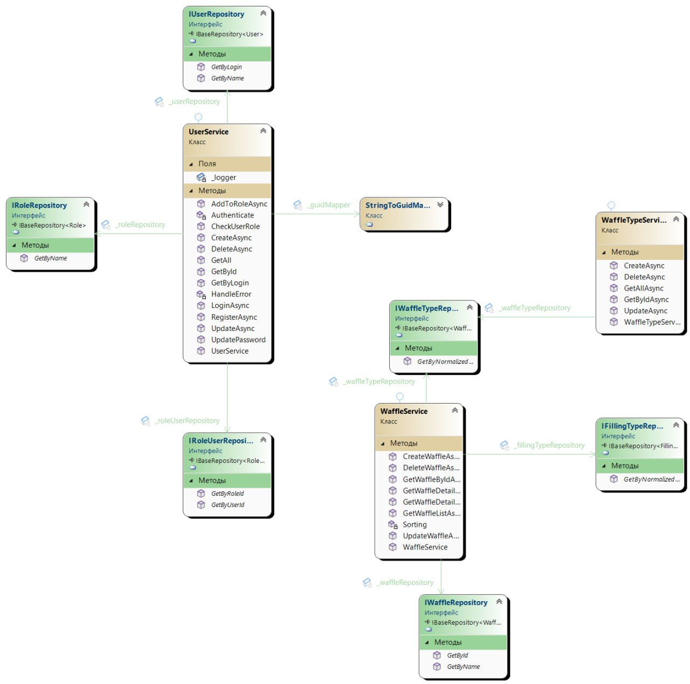

# Исследование архитектурного решения
## Проектирование архитектуры

### 1.1 Определение типа приложения
Выбор соответствующего типа приложения – ключевой момент процесса проектирования приложения.
Этот выбор определяется конкретными требованиями и ограничениями среды.
Также от многих приложений требуется поддержка множества типов клиентов.
Приложение "Waffles Club", разработанное командой "The Quartet" является веб-приложением.
Так как в первую очередь приложение доступно через Интернет, пользовательский интерфейс не зависит от платформы, а также его логика реализована на стороне сервера.
Приложения этого типа, как правило, поддерживают сценарии с постоянным подключением и различные браузеры, 
выполняющиеся в разнообразнейших операционных системах и на разных платформах.

### 1.2 Выбор стратегии развертывания
На этапе проектирования приложения и выявления бизнес-требований был произведен анализ выбора стратегии развертывания приложения. 
Команда остановилась на нераспределенном развертывании приложения. Данный выбор был обоснован простотой реализации и обеспечением более высокой производительности. 
Однако данный подход снижает общую масштабируемость приложения. 
Но, так как бизнес-требования к проекту не предусматривают его последующую масштабируемость, этот недостаток не имеет критического значения.
Также вся функциональность и слои приложения, кроме
функциональности хранения данных, располагаются на одном сервере, что является ключевым условием нераспределенного развертывания.

### 1.3 Обоснование выбора технологий
1. Язык написания приложения:
   - C# - быстрый, синтаксический простой, легко читаемый. Для данной технологии имеется много готовых программных решений для разработки веб-приложений
2. Платформа:
   - .NET. Основными критериями выбора данной технологий являются кросплатформенность и удобство разработки.
3. Фреймворки: 
    - ASP.NET Core - фреймворк для языка C#. Является одним из лучших для написания веб-приложений на рынке.
  Имеет большое количество инструментов для облегчения разработки. Одной из самых ярких является технология Razer pages, которая используется в данном проекте. 
   - Entity Framework - ORM-для упрощения разработки. Дает возможность работать с таблицами базы данных как с сущностью.
4. База данных: PostgreSQL. Данная реляционная база данных была выбрана не случайно. Она является самой популярной среди своего класса. Имеет множество полезных функций, которые помогают разработчикам, такие как: 
    - Поддержка множества типов данных в том числе XML, JSON, NOSQL-баз.
    - Возможность работы с большими ообъемами данных
    - Поддержка сложных запросов
    - Одновременная модификация базы
5. Библиотеки логгирования:
   - NLog. Выбор был осуществлен из-за объемного поддерживаемого функционала ведения журнала логгирования, будь то обычные log-файлы, либо log-строки в терминале при работе приложения.

### 1.4 Показатели качества
- Взаимодействие с пользователем/удобство и простота использования. Интерфейс приложения проектировался с учетом требований пользователей данного продукта, так он прост в использовании, обеспечивает хорошее взаимодействие с пользователем в общем. 
- Тестируемость. По мере разработки код покрывается тестами. Так это является основным критерием проверки системы и работоспособности ее компонентов.
- Безопасность. В приложении были реализованы функции безопасности для защиты ресурсов и предотвращения несанкционированного доступа к пользовательским данным.
- Надежность. Проект надежен, так как способен сохранять работоспособность в течение определенного времени.
- Удобство и простота обслуживания. При добавлении новой функциональности либо изменении каких-либо бизнес-требований внесенные изменения не влияют на работоспособность всего проекта, а лишь на отдельную его часть благодаря слабой связности кода.

### 1.5 Пути реализации сквозной функциональности
В приложении присутствуют несколько путей реализации сковозной функциональности:
- Аутентификация: Система распознает пользователя по его учетным данным и предоставляет и в успешном случае предотавлет доступ к системе. 
- Авторизация: На основе роли пользователя система предоставляет пользователю доступ к тем или иным ресурсам приложения
- Управление исключениями: Все исключительные ситуации приложения обрабатываются централизовано и отлавливаются по всему приложению глобально
- Инструментирование и протоколирование: Обеспечивается мониторинг выполнения основных функций бизнес-логики приложения.

### 1.6 Структурная схема приложения на основе функциональных блоков

## Анализ архитектуры

### 2.1 Диаграмма классов части приложения
В диаграмме классов отражена часть бизнес-логики над сущностями пользователь и продукт, так как данные сущности являются самыми главными в приложении.
На диаграмме показаны два уровня: сервисов (основной уровень бизнес-логики) и репозиториев (уровень доступа к базе данных). 
Выбор был основан на том, что именно два этих слоя показывают основные процессы взаимодействия между компонентами приложения.

## Сравнение и рефакторинг

### 3.1 Сравнение архитектур и определение их отличий
Архитектура "To be" - это уже готовый результат выполнения данного проекта. Это схема, которая представлена в виде больших абстрактных блоков, в свою очередь
архитектура "As is" - это архитектура уже готовой функциональности на данном этапе разработки приложения. Она имеет более детализированный вид определенной небольшой части проекта.
Детализация определена на уровне классов и сигнатур их методов. На архитектуре "As is" не указываются внешние блоки абстракции: реализации сквощной функциональности, внешние API, слой представления. 
Так как данная информация не имеет каких-либо конкретных деталей. 

### 3.2 Пути улучшения архитектуры
Для улучшения архитектуры можно выделить: 
1. Принципы проектирования, также известные как принципы SOLID:
    - SINgle Responsibility PrINciple
    - Open-Closed PrINciple
    - Liskov Substitution PrINciple
    - INTerface Segregation PrINciple
    - Dependency INversion PrINciple
2. Архитектурные стили: 
   - REST
3. Приемы проектирования: 
   - Описание сначала основных сущностей кодом, а потом создание БД
   - Описание сначала БД, а потом уже сущностей приложения, что является полностой противоположностью предыдущего подхода
   - TDD. Основная суть в том, что сначала пишутся тесты на функциональность, а только потом эта функциональность реализуется

