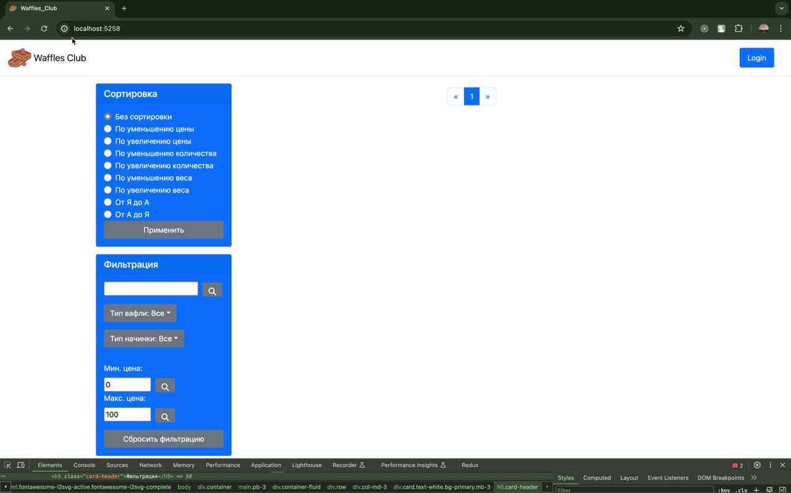
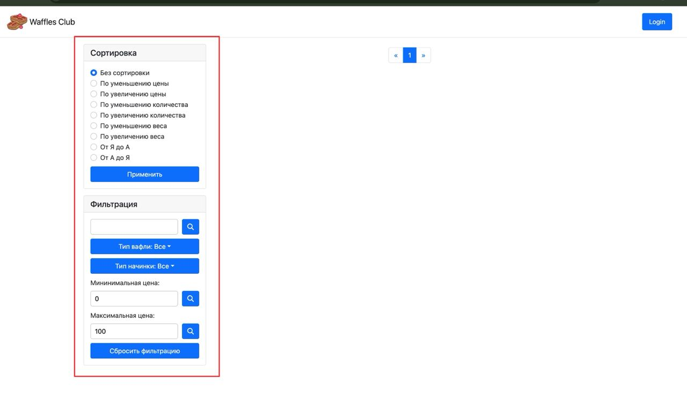
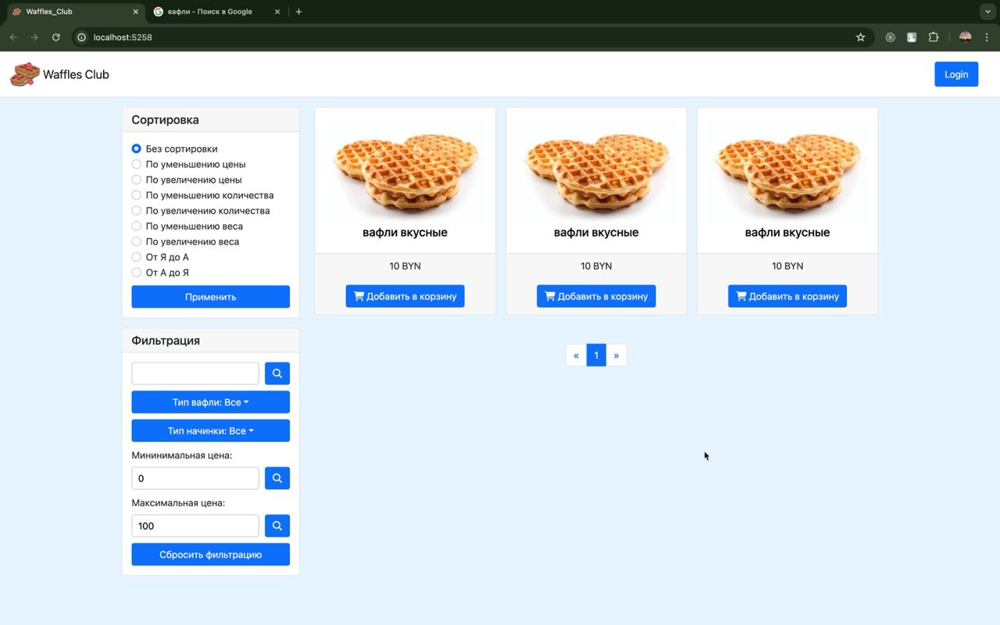

# Улучшение UX

## 1 Оценка разрабатываемого ПО по атрибутам качества

### 1.1 Распознаваемость соответствия:

Этот атрибут определяет, насколько легко пользователь может понять,
какой функционал ПО предлагает в конкретной ситуации.
Чем лучше распознаваемость, тем быстрее пользователи смогут понять,
как использовать ПО без дополнительной информации.
В контексте нашего приложения это означает, что пользователь должен понимать,
что он пользуется интернет-магазином для покупки вафель различных видов.
На главной странице отображается список вафель, их цена, вид.
Есть фильтрация по категориям вафель. Данный пункт при разработке UI выполнен на высоком уровне.

### 1.2 Обучаемость:

Этот атрибут отражает, насколько легко новые пользователи могут освоить ПО и достичь требуемого уровня
производительности.
Обучаемость включает в себя наличие документации, руководств пользователя и интуитивно понятного интерфейса.
Данный проект имеет невысокий порог для обучаемости. Это означает, что руководство для пользователя не должно быть
слишком избыточным.
К сожалению, ввиду устранения технического долга по предыдущим задачам, не было уделено достаточно времени на реализацию
руководства для пользователя.
Но, как мы упомянули в предыдущем пункте, наше приложение "The waffles club" имеет очень понятный
user-friendly-интерфейс. Таким образом, можно сказать,
что данный пункт, хоть и не выполнен в идеале, но он также имеет высокую оценку в контексте разговора о разработке
нашего приложения.

### 1.3 Используемость (операбельность):

Используемость оценивает удобство использования ПО.
Это включает в себя понимание пользовательских потребностей,
интуитивный интерфейс и удобство навигации.
Если ПО имеет высокую используемость,
пользователи будут чувствовать себя комфортно при работе с ним.
Наш проект достаточно удобен, и интуитивно понятен. Все окна и вкладки подписаны, либо имеют ярко выраженные
изображения, что улучшает удобство навигации.
В проекте реализованы различные варианты фильтрации и поиска,
изменения и удаления заказов, функциональность корзины.
Данные методы, совместно с удобной навигацией, показывают потенциальную высокую степень использования нашего приложения.

### 1.4 Защита от ошибок пользователя:

Этот атрибут касается возможности ПО предотвращать ошибки, которые могут быть совершены пользователем.
Это может включать в себя предупреждения, подтверждения действий и четкую обратную связь для пользователя.
К сожалению, данный атрибут реализован только на back-end части. Ввиду недостатка времени на UI части это не было
реализовано.
Поэтому, можно сказать, что, к сожалению этот уровень имеет очень низкую оценку в контексте нашего приложения.

### 1.5 Эстетика GUI:

Эстетика графического интерфейса пользователя (GUI) отражает визуальное оформление ПО.
Привлекательный и профессиональный дизайн может улучшить впечатление пользователя и сделать использование ПО более
приятным.
Дизайн нашего интернет-магазина привлекательный и профессиональный. Стильные фотографии вафель, четкая цветовая палитра
и логотип магазина создают положительное впечатление у посетителей.
Это показывает высокую квалификацию нашего front-end-разработчика в отношении к данному атрибуту.

### 1.6 Доступность:

Доступность оценивает возможность использования ПО людьми с ограниченными возможностями,
такими как люди с инвалидностью.
Это включает в себя адаптивные интерфейсы,
возможность использования клавиатуры вместо мыши,
поддержку скринридеров и другие функции, упрощающие доступ к ПО.
Данный функции тоже не предусмотрены в нашем приложении по причине неупоминания об этом пункте в начале разработки
проекта.
Поэтому данный атрибут так же имеет неудовлетворительную оценку в нашем проекте.

## 2. Пути улучшения UX

### 2.1 Перевод на английский язык:

Обоснование: Английский является международным языком коммерции, что увеличивает охват вашего магазина и привлекает
больше иностранных клиентов.
Действие: Переведенный контент теперь доступен на сайте.

### 2.2 Изменение фона:

Обоснование: Чистый и минималистичный фон создает приятное визуальное восприятие и делает контент более читаемым.
Действие: Фон сайта изменен на светлый и нейтральный, что придает ему современный и чистый вид.

### 2.3 Улучшение визуального положения иконок и изображений:

Обоснование: Качественные иконки и изображения делают интерфейс более привлекательным и помогают пользователям быстрее
ориентироваться.
Действие: Иконки и изображения обновлены на более современные и четкие, а качественные фотографии вафель добавлены на
сайт.

### 2.4 Улучшение понимания интерфейса:

Обоснование: Интуитивно понятный интерфейс уменьшает время на освоение для новых пользователей и делает процесс покупки
более комфортным для всех.
Действие: Элементы интерфейса организованы логически, понятные иконки и метки добавлены, а также подсказки и инструкции
внедрены для сложных функций.

## 3. Сравнение UX до-после:

### До улучшения UX:

### После улучшения UX:

